# git 操作指南

1. git clone ssh链接（如git@github.com:id-none/Digital-module.git）把github仓库下载下来
2. git add . 上传所有文件夹内容
3. git commit -m "标签名字" 给add文件增加标签名字
4. git push 推送文件去文档
4. git pull 把云仓库拉到本地下来

# C: A Wealth of Data

## Problem:

在它创建的在线市场中，亚马逊为客户提供了一个对购买进行评级和评论的机会。个人评级——称为“星级评级”——允许购买者用1(低评级，低满意度)到5(高评级，高满意度)的等级来表达他们对产品的满意程度。此外，客户可以提交基于文本的信息——称为“评论”——以表达对产品的进一步意见和信息。其他客户可以对这些评论进行有帮助或无帮助的评级——称为“有帮助评级”——以帮助他们自己的产品购买决策。公司利用这些数据来洞察他们所参与的市场、参与的时间，以及产品设计特征选择的潜在成功。

阳光公司计划在网上市场推出并销售三种新产品:微波炉、婴儿奶嘴和吹风机。他们聘请你的团队作为顾问，以确定关键模式，关系，措施和参数，在过去的客户提供的评级和评论与其他竞争产品，以1)通知他们的在线销售战略和2)确定潜在的重要设计特征，将提高产品的可取性。阳光公司过去曾使用数据来指导销售策略，但他们以前从未使用过这种特殊的数据组合和类型。阳光公司特别感兴趣的是这些数据中基于时间的模式，以及它们是否以有助于公司制作成功产品的方式相互作用。

为了帮助您，Sunshine的数据中心为您提供了吹风机这个项目的三个数据文件。tsv,微波炉。tsv,  pacifier.tsv。这些数据代表了在数据显示的时间段内亚马逊市场上销售的微波炉、婴儿奶嘴和吹风机的客户提供的评级和评论。还提供了数据标签定义的词汇表。提供的数据文件包含您应该用于此问题的唯一数据。

## Requirements：

1. 分析提供的三种产品数据集，以识别、描述和支持数学证据、有意义的定量和/或定性模式、关系、度量，以及星级评级、评论、以及帮助评级，这将帮助阳光公司在他们的三个新的在线市场产品上取得成功。
2. 请用您的分析来解决阳光公司营销总监提出的以下具体问题和要求:
   1. 一旦他们的三种产品在在线市场上销售，确定基于评级和评论的数据度量，这对阳光公司的跟踪是最有信息量的。
   2. 确定并讨论每个数据集中基于时间的度量和模式，这些度量和模式可能表明产品的声誉在在线市场上是上升还是下降。
   3. 确定基于文本的度量和基于评级的度量的组合，以最好地指出潜在的成功或失败的产品。
   4. 特定的星级评级是否会引发更多的评论?例如，用户是否更有可能在看到一系列低星级评级后写一些评论?
   5. 基于文本的评论的特定质量描述符，如“热情”、“失望”等，是否与评级水平密切相关?
3. 写一封一到两页的信给阳光公司的市场总监，总结你们团队的分析和结果。包括你的团队最自信地向市场总监推荐的结果的具体理由。

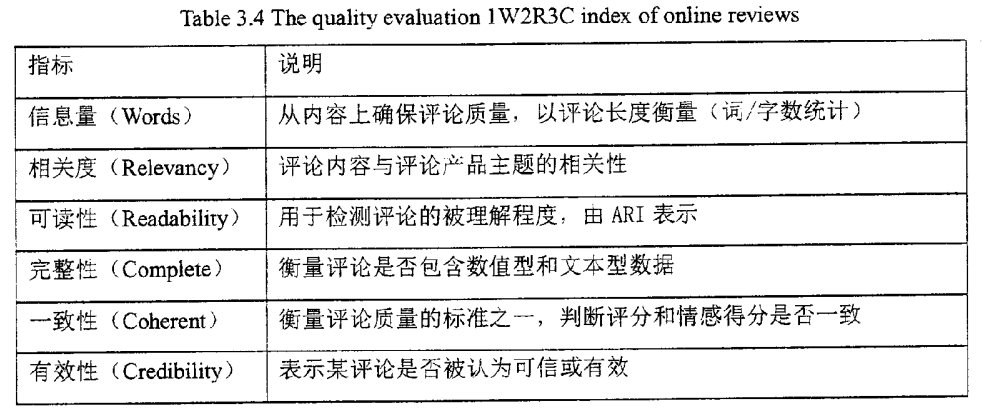

https://d.wanfangdata.com.cn/thesis/ChJUaGVzaXNOZXdTMjAyMTEyMDESCFkzMjcxNDQyGgh4cHJkeXNzcQ%3D%3D

情感分析模型（[LSTM](https://so.csdn.net/so/search?q=LSTM&spm=1001.2101.3001.7020)+RNN）

1. 数据集数据来源http://qwone.com/~jason/20Newsgroups/

   1. 训练集labeledTrainData.tsv(24500条带标签的训练数据)

      id sentiment review 表示文本唯一确认id，情感色彩类别标签，待分析的文本数据

      如下

2. 测试集（testData.tsv：22000条无标签测试数据）

   id 表示文本唯一确认id， review，评论的主体文本数据

2. 基础模型

词向量模型：

由于计算机只认识二进制数字，所以我们映入了词向量模型来解决这个问题。

我们可以将一句话中的每一个词都转换成一个向量。

词向量是具有空间意义的并不是简单的映射！

例如，我们希望单词 “love” 和 “adore” 这两个词在向量空间中是有一定的相关性的，因为他们有类似的定义，他们都在类似的上下文中使用。单词的向量表示也被称之为词嵌入。

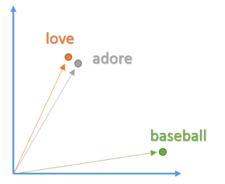

为了去得到这些词嵌入，我们使用一个非常牛逼的模型 “Word2Vec”。简单的说，这个模型根据上下文的语境来推断出每个词的词向量。

Word2Vec 模型根据数据集中的每个句子进行训练，并且以一个固定窗口在句子上进行滑动，根据句子的上下文来预测固定窗口中间那个词的向量。然后根据一个损失函数和优化方法，来对这个模型进行训练。（在文中在我们使用了了谷歌已经训练好的词向量wordList.npy

现在，我们已经得到了神经网络的输入数据 —— 词向量，接下来让我们看看需要构建的神经网络。NLP 数据的一个独特之处是它是时间序列数据。每个单词的出现都依赖于它的前一个单词和后一个单词。由于这种依赖的存在，我们使用循环神经网络来处理这种时间序列数据。

RNN网络结构

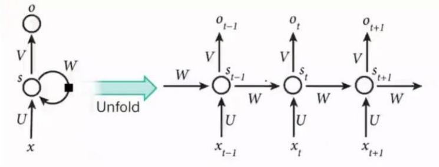

对于基本RNN来说，它能够处理一定的短期依赖，但无法处理长期依赖问题。 当句子比较长，RNN就无法处理这种问题。因为当序列较长时，序列后部的梯度 很难反向传播到前面的序列，这就产生了梯度消失问题。当然，RNN也存在梯度 爆炸问题。

隐藏状态是当前单词向量和前一步的隐藏状态向量的函数。并且这两项之和需要通过激活函数来进行激活。

对于基本RNN来说，它能够处理一定的短期依赖，但无法处理长期依赖问题。 当句子比较长，RNN就无法处理这种问题。因为当序列较长时，序列后部的梯度 很难反向传播到前面的序列，这就产生了梯度消失问题。当然，RNN也存在梯度爆炸问题。

RNN本时刻的隐藏层信息只来源于当前输入和上一时刻的隐藏层信息，没有 记忆功能。为了解决RNN的长期依赖也即梯度消失问题，LSTM应运而生。LSTM 的网络结构图如下：

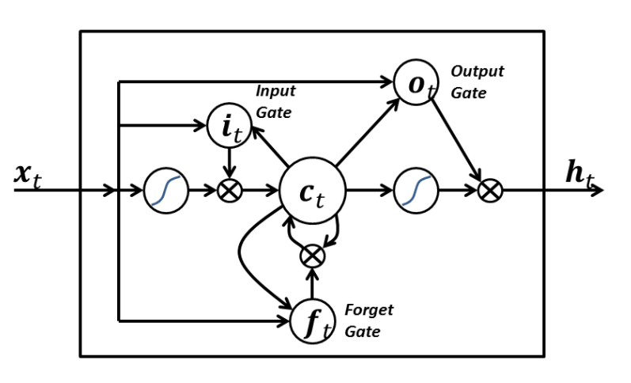

该单元根据输入数据 x(t) ，隐藏层输出 h(t) 。在这些单元中，h(t) 的表达形式比经典的 RNN 网络会复杂很多。这些复杂组件分为四个部分：输入门，输出门，遗忘门和一个记忆控制器。每个门都将 x(t) 和 h(t-1) 作为输入（没有在图中显示出来），并且利用这些输入来计算一些中间状态。每个中间状态都会被送入不同的管道，并且这些信息最终会汇集到 h(t) 。

词频率：

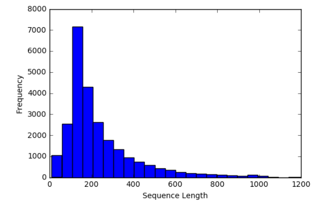

参数调整：

选择合适的超参数来训练你的神经网络是至关重要的。你会发现你的训练损失值与你选择的优化器（Adam，Adadelta，SGD，等等），学习率和网络架构都有很大的关系。特别是在RNN和LSTM中，单元数量和词向量的大小都是重要因素。

- 学习率：RNN最难的一点就是它的训练非常困难，因为时间步骤很长。那么，学习率就变得非常重要了。如果我们将学习率设置的很大，那么学习曲线就会波动性很大，如果我们将学习率设置的很小，那么训练过程就会非常缓慢。根据经验，将学习率默认设置为 0.001 是一个比较好的开始。如果训练的非常缓慢，那么你可以适当的增大这个值，如果训练过程非常的不稳定，那么你可以适当的减小这个值。

- 优化器：这个在研究中没有一个一致的选择，但是 Adam 优化器被广泛的使用。

- LSTM单元的数量：这个值很大程度上取决于输入文本的平均长度。而更多的单元数量可以帮助模型存储更多的文本信息，当然模型的训练时间就会增加很多，并且计算成本会非常昂贵。

- 词向量维度：词向量的维度一般我们设置为50到300。维度越多意味着可以存储更多的单词信息，但是你需要付出的是更昂贵的计算成本。

  训练图片：

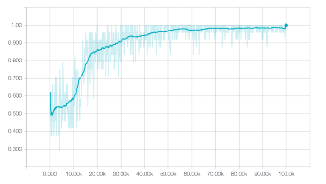

## Prophet（时序数据预测）参考https://zhuanlan.zhihu.com/p/52330017和https://peerj.com/preprints/3190/

Prophet算法实现：

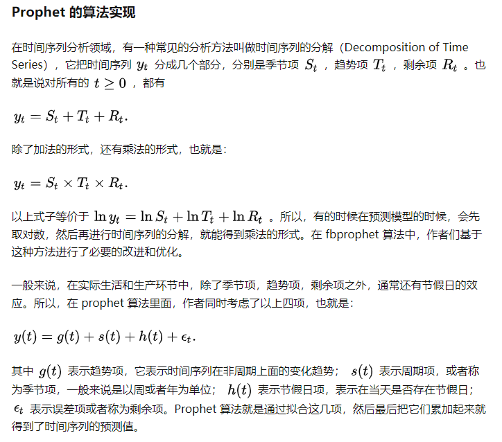

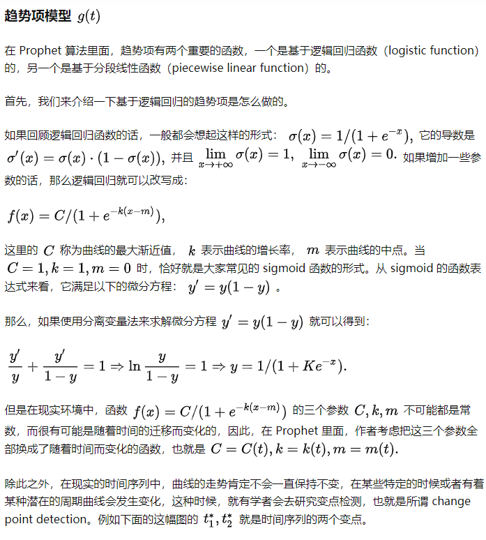

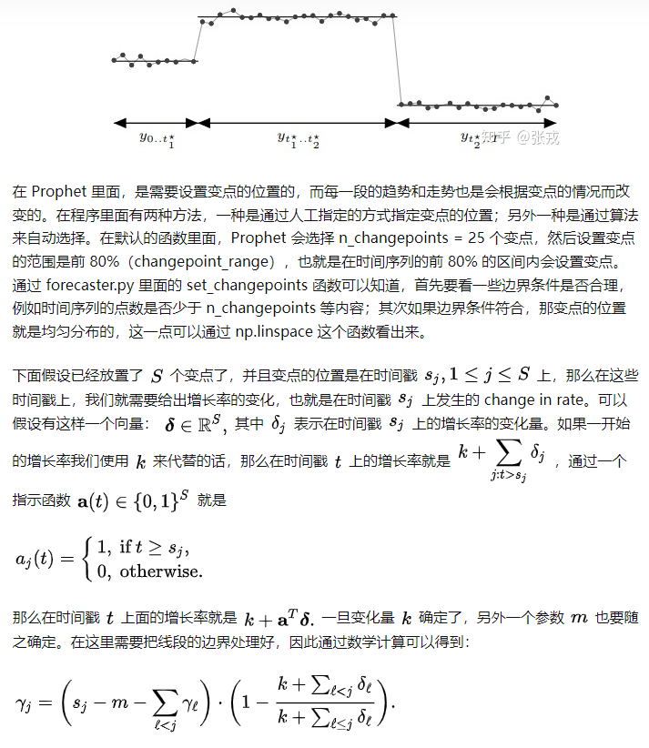

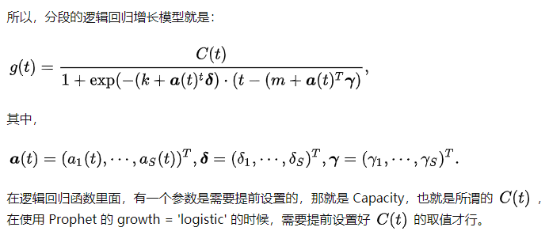

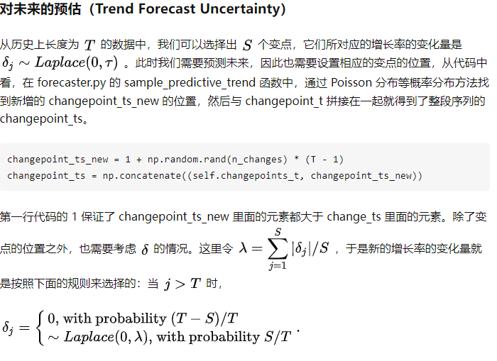

## 灰色关联分析

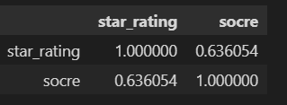

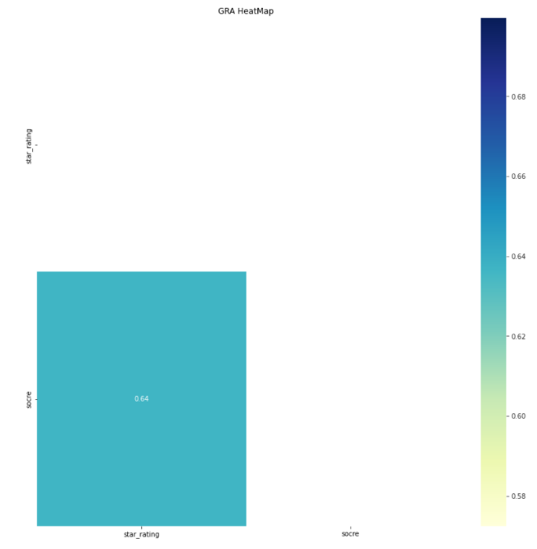
